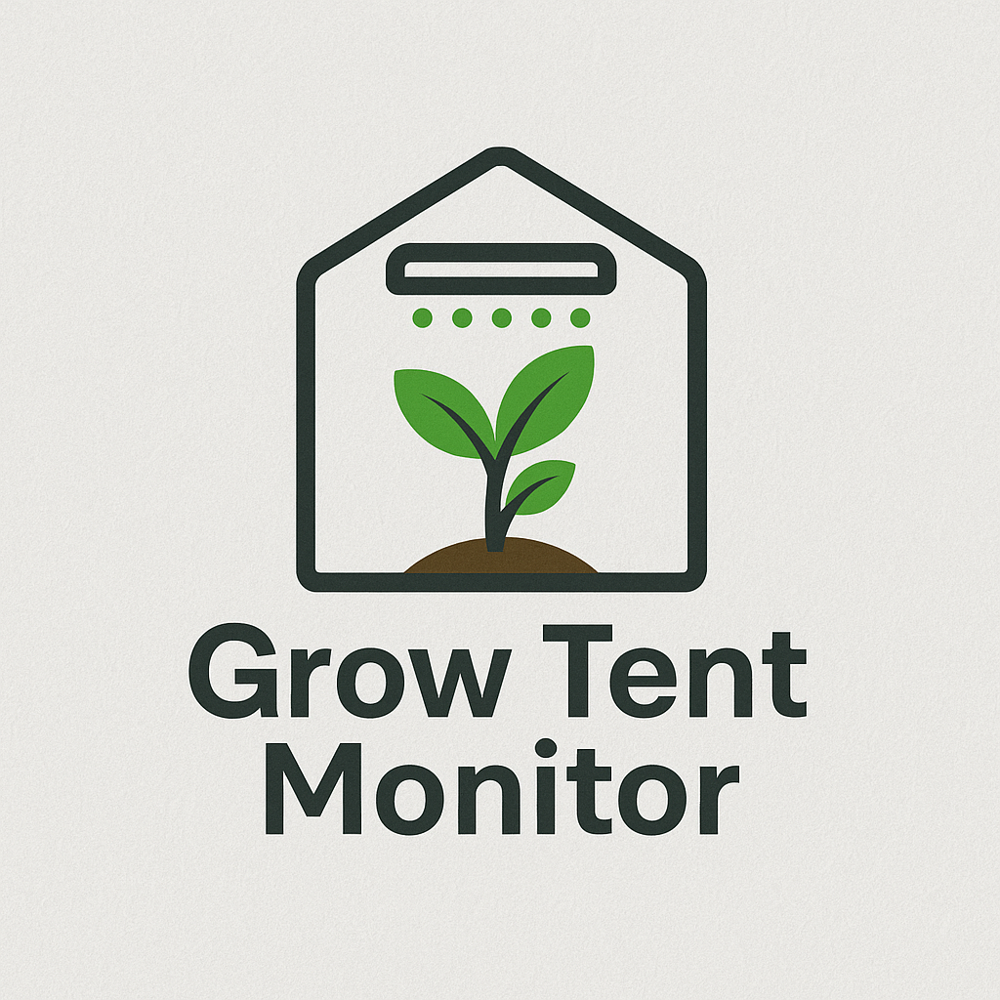

<p align="center">
  
</p>

# Grow Tent Monitor

A lightweight Raspberry Pi-based monitoring system for capturing and displaying live images of an indoor grow tent. Snapshots are taken at regular intervals using a USB webcam and displayed via a local Flask web dashboard.

This project is built to be modular and easily expandable with temperature, humidity, light, and soil sensors - perfect for smart garden automation or IoT portfolios.

## This project is still in progress and not yet complete! 😊

---

## Features

- Captures snapshots of your grow tent using a webcam
- Saves images with timestamps locally
- Displays a historical view in a browser-based dashboard
- Can be scheduled via `cron` or run manually
- Easily extendable with sensor data (temp, humidity, light, soil, etc.)

---

## Tech Stack

| Component         | Stack / Tools                    |
|------------------|----------------------------------|
| OS & Hardware     | Raspberry Pi OS + USB Webcam     |
| Backend Logic     | Python 3, OpenCV, cron           |
| Web Dashboard     | Flask, HTML (Jinja2 Templates)   |
| Image Storage     | Local file system (static folder)|
| Future Sensors    | DHT22, BH1750, Capacitive Soil   |

---

## Project Structure

```
grow-tent-monitor/
├── app.py                # Flask app serving the dashboard
├── capture_image.py      # Webcam image capture script
├── templates/
│   └── index.html        # Dashboard UI
├── static/
│   └── snapshots/        # Saved images
├── README.md             # You're here
```

---


## Future Enhancements

- [ ] Add sensor logging (temp, humidity, soil moisture)
- [ ] Integrate Chart.js for live data graphs
- [ ] Add timestamp overlay on snapshots
- [ ] Discord or email alerts for threshold triggers
- [ ] Run Flask app as a background service on boot

---

## Author

**Lane McAuley**  
[GitHub](https://github.com/the-hallowz)  
[LinkedIn](https://www.linkedin.com/in/lane-mcauley)

---

## License

MIT License - Free to use and modify.

---

> *Built to monitor my grow tent. Learned a ton in the process - and it smells great in there.*
